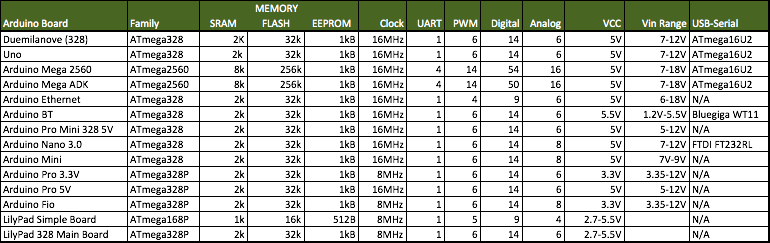

# arduino
all my Arduino projects notes and resource links

#### Arduino Model Comparison Chart

[Comparison Guide](https://learn.sparkfun.com/tutorials/arduino-comparison-guide)

#### Project Ideas
1. [10 Awesome Beginner Project Ideas](https://www.hackster.io/RoyTobby/10-awesome-beginner-arduino-projects-78a6a6)
2. [How to control Arduino board using a phone?](http://www.instructables.com/id/How-control-arduino-board-using-an-android-phone-a/)
3. [Build your own Amazon Echo](https://create.arduino.cc/projecthub/ahmedismail3115/arduino-based-amazon-echo-using-1sheeld-84fa6f)

#### Tools
1. [EasyEDA - Online PCB Design Tools](https://easyeda.com/)
2. [Travis Arduino Continous Integration](https://github.com/adafruit/travis-ci-arduino)

### Resources
1. [Seeed Studio](https://www.seeedstudio.com/)
